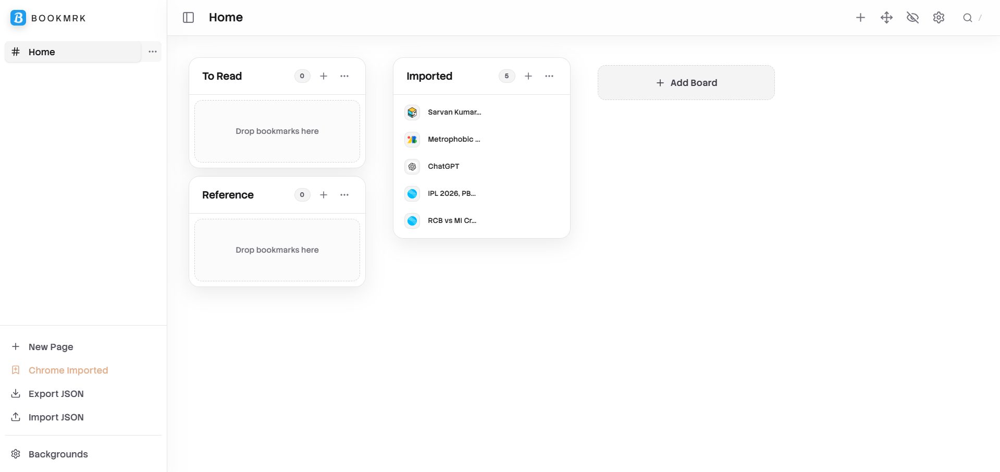

# Bookmrk

Bookmrk is a lightweight, open-source bookmark manager built with React, TypeScript, Vite and Tailwind CSS. It is designed as a modern local-first bookmark manager with quick-save keyboard shortcuts, multi-board organization, cloud/Chrome import fallback, flexible backgrounds, and a mobile-friendly responsive grid.

This README is intended to be a comprehensive reference for users and contributors: installation, usage, architecture, data model, storage & migration, development and contribution guidelines, troubleshooting, and FAQs.

#### Design is inspired from "DISCORD"

## Table of Contents
- **Overview**
- **Features**
- **Quick Start (User)**
- **Keyboard Shortcuts**
- **Usage & Workflows**
- **Storage, Import & Export**
- **Data Model**
- **Theming & Backgrounds**
- **Architecture & Code Structure**
- **Development Setup**
- **Build & Run Commands**
- **Testing, Linting & Formatting**
- **Contribution Guide**
- **Troubleshooting & FAQ**
- **Privacy & Data Considerations**
- **License & Contact**

## Overview

Bookmrk helps you capture and organize web pages into Boards and Pages. It focuses on fast keyboard-driven capture (Quick Save), portable storage, and a clean UI with modal-based input and toasts instead of intrusive browser prompts.

Key design goals:
- Fast capture with minimal friction (Quick Save keyboard binding)
- Organize bookmarks into Boards and Pages (like folders + boards)
- Local-first persistence with optional Chrome bookmarks import
- Configurable background (HEX, image URL, upload)
- Accessible, centralized modals rendered via portals for consistent UX

## Features

- Quick Save: press Ctrl/Cmd + Shift + Y on any page to save it to a `Quick Saves` board (auto-created if missing).
- Boards & Pages: multiple boards per page, multiple pages; responsive grid layout (up to 4 columns on wide screens).
- Centered modals and accessible inputs: all modals are portaled to the app root and theme-aware.
- Background options: set a background color, external image URL, or upload an image (stored as data URL).
- Toast notifications: replace alerts/prompts with in-app toasts (auto-dismissable).
- Board actions: edit name, delete (with confirmation), summon (open all bookmarks), add bookmark.
- Page actions: rename and delete (with safe-guards preventing deleting the last page).
- Chrome integration: optional import of Chrome bookmarks when running as an extension; a flag prevents repeated imports.
- Export/Import JSON: export user data (background stripped by default for safe portability), import JSON to restore data.

## Quick Start (User)

Prerequisites: a modern browser or the local app built from source.

1. Open the app (development: `npm run dev` - see Development Setup).
2. Create Pages and Boards via the `+` controls.
3. To quickly save the current page in the browser, press `Ctrl/Cmd + Shift + Y` — Bookmrk will create or use the `Quick Saves` board and save the page.
4. Use Board settings (⋯ menu) to rename, delete, or summon bookmarks.

## Keyboard Shortcuts

- Quick Save: `Ctrl`/`Cmd` + `Shift` + `Y` — save current browser page to `Quick Saves`.
- Global focus/search (if configured): open via toolbar search button.

Note: Browser-level keyboard handling may vary across platforms and OS; when running as an extension, Chrome-specific platform behavior applies.

## Usage & Workflows

- Quick Save workflow: quick-capture many pages during browsing sessions — the Quick Saves board collects these. Periodically move or curate entries into other boards.
- Summoning bookmarks: use the Summon action on a board to open all bookmarks (use cautiously — popup blockers or tab explosions may occur). Consider using the Summon first-N enhancement if you have many bookmarks.

## Storage, Import & Export

Persistence is provided by `src/storage/local.ts`. Bookmrk uses the browser extension APIs (when available) and falls back to `localStorage` otherwise.

- Chrome import: When run in an extension context, Bookmrk can import your Chrome bookmarks into an `Imported Bookmarks` board and sets a `chromeBookmarksImported` flag to prevent repeated imports.
- Export JSON: Exports the application data model as JSON. By design, exported JSON excludes the background image/data to keep exports small and portable. You can manually include background data if desired for full fidelity.
- Import JSON: Restore or migrate data by importing a JSON file generated by Bookmrk (or the compatible data structure). The import flow validates basic fields and merges or replaces data depending on import mode.

### Migration notes

- If you have an older Bookmrk export (or another import source), map the fields to the current `BookmrkData` shape. Pay attention to `chromeBookmarksImported` (boolean) and `background` (object | null).

## Data Model

Core TypeScript types are defined in `src/shared/types.ts`. The important shapes:

- `Bookmark` — { id, url, title, notes?, createdAt }
- `Board` — { id, name, bookmarks: Bookmark[] }
- `Page` — { id, name, boards: Board[] }
- `BookmrkData` — { pages: Page[], meta: { createdAt }, chromeBookmarksImported?: boolean, background?: Background | null }

Background types:
- { type: 'color', value: '#RRGGBB' }
- { type: 'url', value: 'https://...' }
- { type: 'data', value: 'data:image/png;base64,...' }

## Theming & Backgrounds

- The app supports light/dark surfaces and respects the user's `prefers-color-scheme` by default. Modal surfaces use `#000000` in dark mode and `#FFFFFF` in light mode to ensure contrast and consistent visuals.
- Backgrounds applied via the Background modal are persisted in the store and affect the home page only. Uploaded images are stored as data URLs — note that large images can inflate storage. Consider compressing images before upload.

## Architecture & Code Structure

Top-level structure (important files/directories):
- `src/App.tsx` — Application root, global modal mounting and theme fallback.
- `src/store/useStore.ts` — Zustand store: pages, boards, bookmarks, background, modals, and toasts.
- `src/storage/local.ts` — Persistence adapter (chrome.storage.local when available, otherwise localStorage). Handles export/import operations.
- `src/shared/types.ts` — Central TypeScript types.
- `src/components/` — UI components and modal implementations:
  - `Background/BackgroundModal.tsx` — background manager (HEX/URL/upload).
  - `Shared/InputModal.tsx` — reusable input modal.
  - `Bookmark/QuickSaveModal.tsx` — Quick Save keyboard handler and UX.
  - `Board/BoardColumn.tsx` — board UI and BoardSettingsModal.
  - `Page/PageView.tsx` — pages, responsive grid and DnD context.
- `src/store/` — global state & helpers.

DnD is implemented with `@dnd-kit/core` and `@dnd-kit/sortable`. Portals use `createPortal` from `react-dom` to ensure modals render at the document root and center properly.

## Development Setup

Prerequisites: Node.js 18+ and npm.

1. Install dependencies:

```bash
npm install
```

2. Start development server (hot reload):

```bash
npm run dev
```

3. Build for production:

```bash
npm run build
```

4. Preview production build locally:

```bash
npm run preview
```

## Scripts

- `npm run dev` — start Vite dev server
- `npm run build` — production build
- `npm run preview` — preview production build locally

## Testing, Linting & Formatting

- Add tests and linters as needed — repository currently focuses on core functionality. Consider adding `vitest` for unit tests, `eslint` for linting, and `prettier` for formatting.

## Contribution Guide

We welcome contributions. High-level workflow:

1. Fork the repo and create a topic branch for your change.
2. Run the app locally and ensure functionality passes.
3. Open a pull request describing the change, tests, and any migration steps.

Developer notes:


## Example Screenshots & Annotated Flows

Placeholders for screenshots live in `docs/screenshots/`. Add images there using the suggested filenames for consistent documentation:

- `home-4-up.png` — Home page showing 4-column grid (suggested size: 1600×900)
- `quick-save-modal.png` — Quick Save modal open (suggested size: 800×600)
- `board-settings.png` — Board Settings modal (suggested size: 800×600)
- `background-modal.png` — Background modal showing color/url/upload options (suggested size: 800×600)

Guidelines:
- Use PNG or JPEG. Keep screenshots under 300 KB when possible.
- For annotated flows, add an SVG or PNG named `flow-quick-save.png` and include a short caption below the image in the README section where you reference it.

Example Markdown to embed a screenshot (replace with actual file when added):

```markdown

```

## Migration Script Example

When the persisted data shape changes between releases, a small migration script can help convert older exports to the current `BookmrkData` shape. Add and run this script locally to transform an exported JSON file.

Example script: `scripts/migrate_v1_to_v2.ts` — usage:

```bash
# install ts-node if you don't have it
npm install -D ts-node typescript

# run migration
npx ts-node scripts/migrate_v1_to_v2.ts old-export.json migrated.json
```

This example script performs conservative transforms:
- ensures `chromeBookmarksImported` exists (defaults to `false`)
- normalizes `background` to explicit `{ type, value } | null`
- ensures `createdAt` timestamps exist on top-level meta

See `scripts/migrate_v1_to_v2.ts` for the implementation.

## Contributor Checklist & PR Template

I've added a Pull Request template at `.github/PULL_REQUEST_TEMPLATE.md` with a contributor checklist to make reviews faster. The checklist includes items for tests, docs, migrations, and changelog notes.

When opening a PR, please include:

- A summary of the change and its rationale.
- Before/after screenshots if UI is affected (place under `docs/screenshots/`).
- Any migration steps or data shape changes and a link to the migration script if applicable.
- Update to `README.md` or docs when features or developer flows change.

---

Files added by this update:

- `docs/screenshots/README.md` (guidance + placeholders)
- `scripts/migrate_v1_to_v2.ts` (example migration script)
- `.github/PULL_REQUEST_TEMPLATE.md` (PR template & checklist)


## Troubleshooting & FAQ

Q: Quick Save isn't working in my browser.
<br/>
A: Ensure the page has focus and the app/extension is active. Browser-level keybindings can conflict; try the toolbar Quick Save button as a fallback.
<br/>
Q: I imported Chrome bookmarks and the button is disabled.
<br/>
A: That's by design — Bookmrk sets `chromeBookmarksImported` to avoid duplicate imports. If you need to re-import, you have two safe options:

- Delete the `Imported Bookmarks` board from the UI; Bookmrk will automatically clear the import lock and re-enable the `Import Chrome` button.
- Or (advanced) clear the `chromeBookmarksImported` flag manually in storage (not recommended unless you know what you're doing).
<br/>

Q: My exported JSON is missing my background image.
<br/>
A: Bookmrk intentionally omits background data from exported JSON to keep exports small. If you need the background included, open the storage code in `src/storage/local.ts` and adjust the export function.
<br/>
Q: Summon opened too many tabs.
<br/>
A: Summon opens all bookmarks in a board. Use with caution with large boards
<br/>
## Privacy & Data Considerations

- Bookmrk stores data locally (browser storage or extension storage). Uploaded images are persisted as data URLs and may contain sensitive metadata. Avoid uploading very large images.
- Chrome bookmark import reads local browser bookmarks when the extension has permission — the import is performed locally and not transmitted off-device by default.

## License & Contact

This project is open source.

For questions, issues, or contributions, open an issue or pull request in the repository.